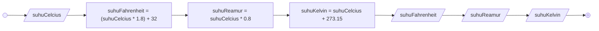

# Konversi Suhu

## Flowchart

```mermaid
flowchart LR

A@{shape: sm-circ, label: "Start"}
B@{shape: fr-circ, label: "End"}
C@{shape: lean-r, label: "suhuCelcius"}
D@{shape: rect, label: "suhuFahrenheit = (suhuCelcius * 1.8) + 32"}
E@{shape: rect, label: "suhuReamur = suhuCelcius * 0.8"}
F@{shape: rect, label: "suhuKelvin = suhuCelcius + 273.15"}
G@{shape: lean-r, label: "suhuFahrenheit"}
H@{shape: lean-r, label: "suhuReamur"}
I@{shape: lean-r, label: "suhuKelvin"}

A --> C --> D --> E --> F --> G --> H --> I --> B
```
